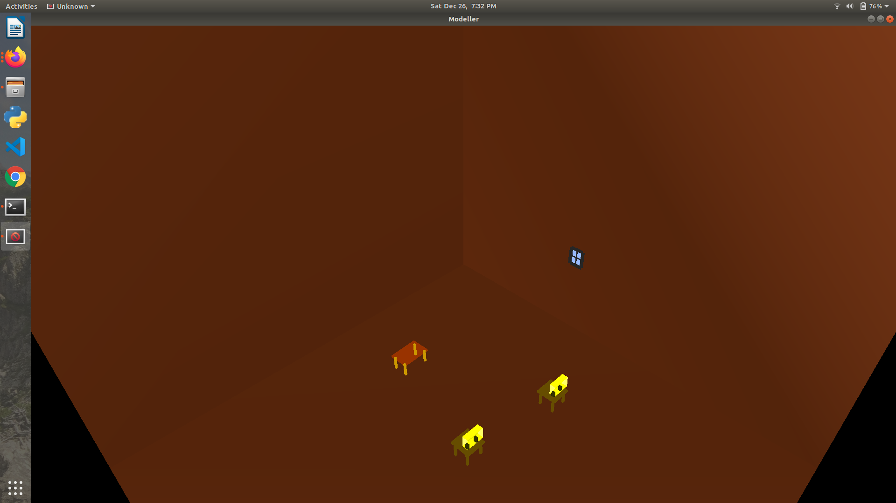

# Simple Modeler (OpenGL/GLUT)
This is a simple 3D modeling system using OpenGL and C++. 

  

## Functions
1. **Scene Object Structure & Rendering:** All objects are stored in a list. The display loop iterates over the loop.
2. **Adding Objects:** You can create an object at a random position of one of the three defined shapes (Table, Chair, Windows).
3. **Interacting with Objects:** You can rotate/translate/scale the selected object with some commands.
4. **Save/Load txt file:** You can save the current scene to a txt file. You NEED to enter the file name (without .txt). All information about the scene and objects will be saved. To load a txt file, you need to enter the file name (without .txt).
  
## Instruction
Under the path of the folder, use the command `make` to run the program.

Use the L command followed by  filename ClassDraw to get the Classroom Model.

| Controls | Functions |
|:----------:|-------------|
| q/esc | quit |
| SPACE | create an object at a random position |
| Left click | select an object if possible |
| Right click | delete the clicked objects |
| r | reset the scene, clear all objects |
| s | save objects to a file, need to type the file name (without .txt) in the console |
| l | load the file and restore objects, need to type the file name (without .txt) in the console |
| x | select/unselect x axis of the selected object, not working if no object is selected |
| y | select/unselect y axis of the selected object, not working if no object is selected |
| z | select/unselect z axis of the selected object, not working if no object is selected |
| UP/DOWN | When an object or a light is selected, translate it in the selected axis, not working if no axis is selected |
| LEFT/RIGHT | When an object or a light is selected, rotate it in the selected axis, not working if no axis is selected |

## Link to original Repo : 
https://github.com/Emilieczq/Simple-Modeler
